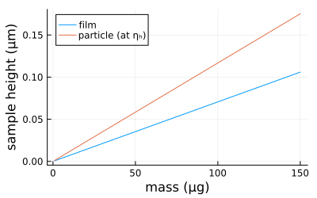
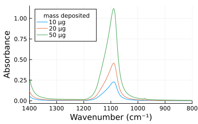

# ATRSim.jl


[](https://github.com/stakahama/ATRSim.jl/actions/workflows/CI.yml?query=branch%3Amain)

ATR calculations from Arangio et
al. doi:[10.1177/0003702818821330](https://doi.org/10.1177/0003702818821330),
2019. Equations originally taken from the following sources:

- Harrick, N. J., *Internal Reflection Spectroscopy*, Harrick Scientific
  Corp.: Ossining, NY, 1979.
- Mirabella Jr., F. M., “Internal Reflection Spectroscopy”, *Applied
  Spectroscopy Reviews*, Vol. 21, No. 1-2, p. 45-178, Taylor & Francis,
  doi:[10.1080/05704928508060428](https://doi.org/10.1080/05704928508060428)
  1985.
- Milosevic M., *Internal Reflection and ATR Spectroscopy*, John Wiley &
  Sons: Hoboken, NJ, 2012.

Following code is also found in `examples/example.jl`.

## Installation

``` julia
using Pkg
Pkg.add(url = "https://github.com/stakahama/SellmeierEqn.jl")
Pkg.add(url = "https://github.com/stakahama/ATRSim.jl")
```

Additionally, [Integrals.jl](https://github.com/SciML/Integrals.jl) is a
dependency for calculating the particle modification factor (χ).

## Usage

``` julia
using DataFrames
using DataFramesMeta
using CSV
using Plots
using Printf
using SellmeierEqn
using ATRSim
```

``` julia
pathname = joinpath(@__DIR__, "examples", "Myers2020_ammsulf.csv")
(ν, n, k) = let ammsulf = @subset CSV.read(pathname, DataFrame; comment="#") @. (650 <= :wavenum <= 4000)
    @with ammsulf (:wavenum, :n, :k)
end
n₂fixed = 1.5 # alternate n₂
```

``` julia
α = @. 1 / log(10) * 4 * π * ν * k * 1e2 # m^-1
```

Define some basic parameters for the HATR (Horizontal Attenuated Total
Reflectance) accessory with ZnSe IRE (infrared element).

``` julia
λ = 1e4 ./ ν # μm
n₁ = refidx(λ, :ZnSe)
N = 10
aIRE = 8.0 * 1e-4 # m^2
θ = 45 / 180 * π
```

The optional last argument defines the refractive index of the third
medium above the sample (air) when the sample is deposited as a thin
film. The data type of variable returned determines the behavior of some
functions (e.g., penetration depth, electric field intensity at the
interface).

``` julia
nₐᵢᵣ = 1.0
n₁fixed = refidx(1e4 / 2000, :ZnSe)
configfilm = ATRConfig(N, aIRE, θ, n₁, nₐᵢᵣ)
configfixed = ATRConfig(N, aIRE, θ, n₁fixed, nₐᵢᵣ)
configbulk = ATRConfig(N, aIRE, θ, n₁)
```

``` julia
println([typeof(configfilm), typeof(configfixed), typeof(configbulk)])
```

    DataType[Thinfilm, Thinfilm, Bulk]

Assume a thickness and particle size for the following examples.

``` julia
d = 0.05 # μm
R = 0.08 # μm
```

Comparison of particle spectra with different assumptions for n₂
(refractive index of sample) - either varying with ammonium sulfate, or
fixed at 1.5.

``` julia
plot(xflip = true, legend = :topleft, xlabel = "Wavenumber (cm⁻¹)", ylabel = "Absorbance")
plot!(ν, α .* d .* ξ(n, configfilm) .* χ(ν, R, configfilm) .* 1e-6, label = "varying n₂")
plot!(ν, α .* d .* ξ(n₂fixed, configfixed) .* χ(ν, R, configfixed) .* 1e-6, label = "fixed n₂")
```


Comparison of spectra with different ATR models.

``` julia
plot(xflip = true, legend = :topleft, xlabel = "Wavenumber (cm⁻¹)", ylabel = "Absorbance")
plot!(ν, α .* d .* ξ(n₂fixed, configfixed) .* 1e-6, label = "thin film")
plot!(ν, α .* d .* ξ(n₂fixed, configfixed) .* χ(ν, R, configfixed) .* 1e-6, label = "particle")
plot!(ν, 0.1 .* α .* deff(ν, n₂fixed, configbulk) .* 1e-6, label = "0.1 × bulk")
```


Relation among deposited mass, film thickness, and equivalent particle
radius (for hexagonal circle packing assumption).

``` julia
ηₕ = π * √3 / 6
ρ = 1.77 * 1e3  # kg / m^3
m = 1:150 # μg
d = m .* 1e-9 ./ aIRE ./ ρ .* 1e6 # μm
R = d ./ (4 / 3 * ηₕ) # μm
```

``` julia
plot(xlabel = "mass (μg)", ylabel = "sample height (μm)")
plot!(m, d, label = "film")
plot!(m, 2 * R, label = "particle (ηₕ)")
```



Simulation of absorbance.

``` julia
Req(m) = m ./ aIRE ./ ρ .* 1e-3 ./ (4 * ηₕ / 3) # μm
m = [10., 20., 50.] # μg
A = hcat(map(m -> prefactor(ν, n₂fixed, Req(m), configfixed) .* α ./ ρ .* m .* 1e-9, m)...)
```

``` julia
plot(ν, A,
     label = reshape(map(m -> @sprintf("%.0f μg", m), m), (1, :)),
     xlabel = "Wavenumber (cm⁻¹)", ylabel = "Absorbance",
     xflip = true,
     legend = :topleft, legendtitle = "mass deposited")
```


``` julia
plot(ν, A,
     label = reshape(map(m -> @sprintf("%.0f μg", m), m), (1, :)),
     xlabel = "Wavenumber (cm⁻¹)", ylabel = "Absorbance",
     xflip = true,
     legend = :topleft, legendtitle = "mass deposited")
xlims!(800, 1400)
```


The following figure depicting the magnitude of particle modification
factor is slightly different from Figure S2 (bottom panel) of Arangio et
al. The version below is calculated assuming the penetration depth is
not be influenced by the sample medium n₂ (bulk), but instead nₐᵢᵣ (thin
flim) (Mirabella, 1985).

``` julia
pl = plot(layout = (2, 1))
plot!(pl[1], xflip = true, ylim = [0, 4],
     xlabel = "Wavenumber (cm⁻¹)", ylabel = "dₚ (μm)", legend = :topleft)
plot!(pl[1], ν, dp(λ, configfixed), 
     label = "thin film")
plot!(pl[1], ν, dp(λ, n₂fixed, ATRConfig(N, aIRE, θ, n₁fixed)), 
     label = "bulk")
d = range(20, 100, step=20) .* 1e-3 # μm
R = d ./ (4 * ηₕ / 3) # μm
plot!(pl[2], ν, hcat(map(R -> χ(ν, R, configfixed), R)...),
     label = reshape(map(d -> @sprintf("%.0f nm", d * 1e3), d), (1, :)), 
     line_z = d', color = cgrad(:blues, rev=true), colorbar = false,
     xlabel = "Wavenumber (cm⁻¹)", ylabel = "χ",
     xflip = true, ylim = [0.5, 1.0],
     legend = :bottomright, legendtitle = "thickness")
```



Plot as a function of deposited mass.

``` julia
m = [10, 20, 50, 100, 120]
plot(ν, hcat(map(m -> χ(ν, Req(m), configfixed), m)...),
     label = reshape(map(m -> @sprintf("%.0f μg", m), m), (1, :)),
     line_z = m', color = cgrad(:blues, rev=true), colorbar = false,
     xlabel = "Wavenumber (cm⁻¹)", ylabel = "χ",
     xflip = true, ylim = [0.5, 1.0],
     legend = :bottomright, legendtitle = "mass deposited")
```


