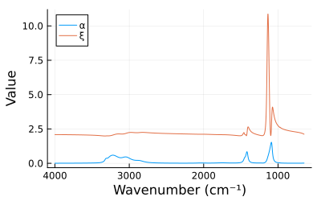
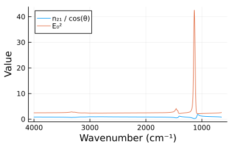
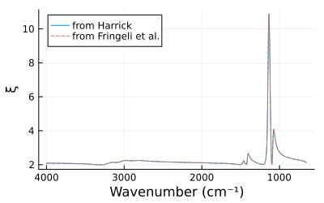
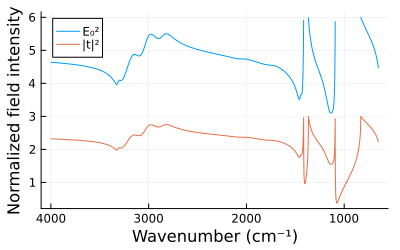
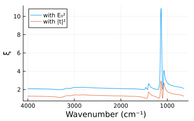
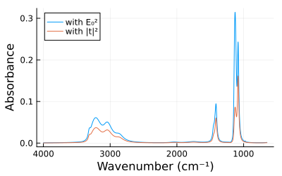
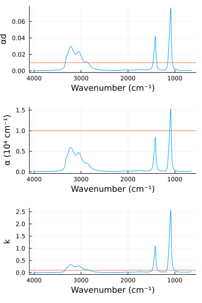

# ATRSim.jl


## Preamble

The following section is the same as the README.

``` julia
using DataFrames
using DataFramesMeta
using CSV
using Plots
using Unzip
using SellmeierEqn
using ATRSim
```

``` julia
pathname = joinpath(@__DIR__, "Myers2020_ammsulf.csv")
(ν, n, k) = let ammsulf = @subset CSV.read(pathname, DataFrame; comment="#") @. (650 <= :wavenum <= 4000)
    @with ammsulf (:wavenum, :n, :k)
end
n₂ = n
n₂fixed = 1.5 # alternate n₂

α = @. 1 / log(10) * 4 * π * ν * k * 1e2 # m^-1

λ = 1e4 ./ ν # μm
n₁ = refidx(λ, :ZnSe)
N = 10
aIRE = 8.0 * 1e-4 # m^2
θ = 45 / 180 * π

nₐᵢᵣ = 1.0
n₁fixed = refidx(1e4 / 2000, :ZnSe)
configfilm = ATRConfig(N, aIRE, θ, n₁, nₐᵢᵣ)
configfixed = ATRConfig(N, aIRE, θ, n₁fixed, nₐᵢᵣ)
configbulk = ATRConfig(N, aIRE, θ, n₁)
```

Assumed film thickness for the following examples.

``` julia
d = 0.05 # μm
```

Additionally, define an often-used quantity.

``` julia
n₂₁ = n₂ ./ n₁
```

## Evaluation of contributions to spectrum

Comparison of particle spectra with different assumptions for n₂
(refractive index of sample) - either varying with ammonium sulfate, or
fixed at 1.5.

``` julia
plot(xflip = true, legend = :topleft, xlabel = "Wavenumber (cm⁻¹)", ylabel = "Absorbance")
plot!(ν, α .* 1e-6 .* d .* ξ(n, configfilm), label = "varying n₂")
plot!(ν, α .* 1e-6 .* d .* ξ(n₂fixed, configfixed), label = "fixed n₂")
plot!(size = (400, 250))
```


The extra peak in the n₂ varying case arises from ξ = deff / d.

``` julia
plot(xflip = true, legend = :topleft, xlabel = "Wavenumber (cm⁻¹)", ylabel = "Value")
plot!(ν, α .* 1e-6, label = "α")
plot!(ν, ξ(n, configfilm), label = "ξ")
plot!(size = (400, 250))
```



Further breaking down ξ = deff / d = n₂₁ / cos(θ) \* E₀².

``` julia
plot(xflip = true, legend = :topleft, xlabel = "Wavenumber (cm⁻¹)", ylabel = "Value")
plot!(ν, n₂₁ ./ cos(θ), label = "n₂₁ / cos(θ)")
plot!(ν, E₀²(n, configfilm), label = "E₀²")
plot!(size = (400, 250))
```



## Normalized electric field intensity

### Confirmation of Harrick equations

For thin films, compare ξ = deff / d. Fringeli et al. outlines an
alternative derivation and form for the calculation of effective
thickness. The values from Fringeli et al. and Harrick are identical
(green and orange lines overlap).

<details class="code-fold">
<summary>Code</summary>

``` julia
"""
    ξF(n₂::Vector{<:Real}, config::Thinfilm)
    ξF(θᵢ::Real, n₁::Real, n₂::Real, n₃::Real)

ξF = deff / d. From Fringeli et al. doi:10.1016/B978-012512908-4/50023-0, 2002. 
"""
function ξF end

function ξF(n₂::Vector{<:Real}, config::Thinfilm)
    (;θ, n₁, n₃) = config
    (ξₑₛ₂, ξₑₚ₂, ξₑₛ₃, ξₑₚ₃) = unzip(ξF.(θ, n₁, n₂, n₃))
    (
        (@. (ξₑₛ₂ + ξₑₚ₂) / 2),
        (@. (ξₑₛ₃ + ξₑₚ₃) / 2)
    )
end

function ξF(θᵢ::Real, n₁::Real, n₂::Real, n₃::Real)
    n₂₁ = n₂ / n₁
    n₃₁ = n₃ / n₁
    n₃₂ = n₃ / n₂
    n₂₃ = n₂ / n₃
    γ = (1 - n₂₁^2) / (1 - n₃₁^2)
    C₁ = (1 + n₃₁^2) * sin(θᵢ)^2 - n₃₁^2
    C₂ = (1 + n₃₂^4) * sin(θᵢ)^2 - n₃₁^2
    C₃ = ((1 + n₃₂^2) * sin(θᵢ)^2 - n₃₁^2) * γ
    C₄ = (1 - n₂₃^2) * (n₃₂^2 - n₃₁^2) * sin(θᵢ)^4
    Gₚ₂ = C₂ / C₁
    Gₚ₃ = (C₃ / C₁ + C₄ / C₁^2) * (1 / γ)
    ξₑₛ₂ = 4 * n₂₁ * cos(θᵢ) / (1 - n₃₁^2)
    ξₑₛ₃ = 4 * n₃₁ * cos(θᵢ) / (1 - n₃₁^2) * γ
    ξₑₚ₂ = ξₑₛ₂ * Gₚ₂
    ξₑₚ₃ = ξₑₛ₃ * Gₚ₃
    (ξₑₛ₂, ξₑₚ₂, ξₑₛ₃, ξₑₚ₃)
end
```

</details>

``` julia
plot(xflip=true, legend=:topleft, xlabel="Wavenumber (cm⁻¹)", ylabel="ξ")
plot!(ν, ξ(n, configfilm), label="from Harrick")
plot!(ν, ξF(n, configfilm), label="from Fringeli et al.", linestyle=:dash)
plot!(size=(400, 250))
```



### Comparison with modified transmission coefficients

An alternative form for normalized electric field intensities (E₀²) at
the sample-IRE interface follow from Fresnel transmission coefficients
(\|t\|²).

Comparison of normalized electric field intensities for bulk samples.

``` julia
plot(xflip = true, legend = :topleft, xlabel = "Wavenumber (cm⁻¹)", ylabel = "Normalized field intensity")
plot!(ν, E₀²(n, configbulk), label = "E₀²")
plot!(ν, t²(n, configbulk), label = "|t|²")
plot!(size = (400, 250))
```



For thin films, compare ξ and apparent absorbances for the thickness
specified previously. For use of \|t\|², a small change is introduced to
the Fresnel equations to accommodate the thin sample that modifies the
parallel polarization transmission coefficient along the *z*-axis
(Beattie et al.,
doi:[10.1016/S0924-2031(00)00084-9](https://doi.org/10.1016/S0924-2031(00)00084-9),
2000).

``` julia
plot(xflip=true, legend=:topleft, xlabel="Wavenumber (cm⁻¹)", ylabel="ξ")
plot!(ν, ξ(n, configfilm), label="with E₀²")
plot!(ν, n₂ ./ n₁ ./ cos(θ) .* t²(n, configfilm), label="with |t|²")
plot!(size=(400, 250))
```



``` julia
plot(xflip=true, legend=:topleft, xlabel="Wavenumber (cm⁻¹)", ylabel="Absorbance")
plot!(ν, α .* 1e-6 .* d .* n₂₁ ./ cos(θ) .* E₀²(n, configfilm), label="with E₀²")
plot!(ν, α .* 1e-6 .* d .* n₂₁ ./ cos(θ) .* t²(n, configfilm), label="with |t|²")
plot!(size=(400, 250))
```



## Evanescent field decay

### Weak absorber approximation

The *weak absorber approximation* for which many of the equations are
increasingly valid in the regimes below horizontal orange lines below
(Fringeli et al., Mirabella).

``` julia
p = plot(layout=(3, 1), xlabel="Wavenumber (cm⁻¹)", xflip=true, legend=false, size=(400, 600))
plot!(p[1], ν, α .* 1e-6 .* d, ylabel="αd")
hline!(p[1], [.01])
plot!(p[2], ν, α .* 1e-6, ylabel="α (10⁴ cm⁻¹)")
hline!(p[2], [1])
plot!(p[3], ν, k, ylabel="k")
hline!(p[3], [.1])
```



Ammonium sulfate has regions which may violate these assumptions.

### Modification to electric field amplitude decay coefficient

When the medium is strongly absorbing (e.g., inorganic compounds),
increased decay of the evanescent field leads to lower penetration
depths and lower apparent absorbance (absorption parameter) as
illustrated by the bulk absorption case where the effect of penetration
depth is most evident (Mirabella).

<details class="code-fold">
<summary>Code</summary>

``` julia
out = let n₂₁ = complex.(n₂₁), λ₁ = 1e4 ./ ν ./ n₁
    ## gamma
    γTIR = @. 2π * √(sin(θ)^2 - n₂₁^2) / λ₁
    γATR = @. 2π / (√2 * λ₁) * 
      √(√((sin(θ)^2 - n₂₁^2 + n₂₁^2 * k^2)^2 + (2 * n₂₁^2 * k^2)) + 
      (sin(θ)^2 - n₂₁^2 + n₂₁^2 * k^2))
    ## electric field components
    Eyo = @. 2 * cos(θ) / sqrt(1 - n₂₁^2)
    Exo = @. Eyo * sqrt(sin(θ)^2 - n₂₁^2) / sqrt((1 + n₂₁^2) * sin(θ)^2 - n₂₁^2)
    Ezo = @. Eyo * sin(θ) / sqrt((1 + n₂₁^2) * sin(θ)^2 - n₂₁^2)
    E0sq = @. (abs2(Eyo) + (abs2(Exo) + abs2(Ezo))) / 2
    ##
    prefactor = @. n₂₁ * α * 1e-6 * E0sq / cos(θ)
    γ = (TIR=γTIR, ATR=γATR)
    a = map(γ -> prefactor ./ 2γ, γ)
    ##
    (
      a = map(v -> map(real, v), a),
      γ = map(v -> map(real, v), γ),
    )
end
```

</details>

``` julia
p = plot(layout=(2, 1), legend=:topleft,
    xflip=true, ylim=[0, 2],
    size=(400, 400))
plot!(p[1], ylabel="dₚ (μm)")
plot!(p[1], ν, 1 ./ out[:γ][:TIR], label="TIR")
plot!(p[1], ν, 1 ./ out[:γ][:ATR], label="ATR")
plot!(p[2], ylabel="absorption parameter")
plot!(p[2], ν, out[:a][:TIR], label="TIR")
plot!(p[2], ν, out[:a][:ATR], label="ATR")
```


